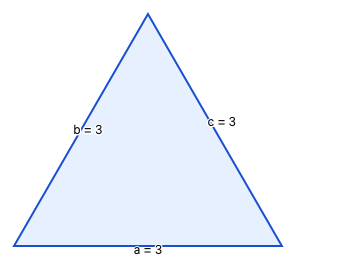
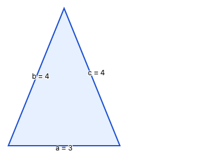
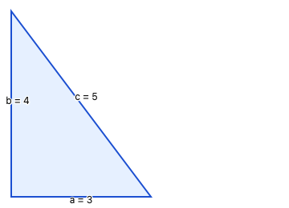

# Type of Triangle

## Objective

Your task is to implement a function that determines the type of triangle formed by three given side lengths.

## Scenario 1: Type of Triangle

A triangle can be classified by the lengths of its sides.

You will implement a function that determines the type of triangle formed by three given side lengths.

Return one of the following enum values:

- TriangleType.EQUILATERAL – all three sides are equal
- TriangleType.ISOSCELES – exactly two sides are equal
- TriangleType.SCALENE – all sides are different
- TriangleType.NONE – the sides cannot form a valid triangle

A valid triangle must satisfy the triangle inequality:

- a + b > c
- a + c > b
- b + c > a

If this condition fails (or if any side ≤ 0), the result is TriangleType.NONE.

Given a = 3, b = 3, and c = 3. 
 
Since all sides are the same length, it is type TriangleType.EQUILATERAL. 
---
Given a = 3, b = 4, and c = 4. 
 
Sides b and c are the same length, so the type is TriangleType.ISOSCELES. 
---
Given a = 3, b = 4, and c = 5. 
 
Since all sides have different lengths, the type is TriangleType.SCALENE. 
---
